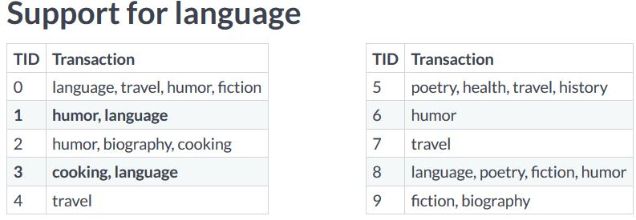

# Market-Basket-Analysis
What do Amazon product recommendations and Netflix movie suggestions have in common? They both rely on Market Basket Analysis, which is a powerful tool for translating vast amounts of customer transaction and viewing data into simple rules for product promotion and recommendation.Market Basket Analysis using the Apriori algorithm, standard and custom metrics, association rules, aggregation and pruning, and visualization.

### What is Market Basket Analysis

#### Selecting a bookstore layout
- A small bookstore carries four genres : fiction, biography, poetry and history. Due to the store's layout, genres must be grouped into two pairs of sections. Shall we have pair of fiction and biography together or fiction and poetry together. We can use Market Basket Analysis here.

1. First, it gives us the tools to identify which products are most frequently purchased together, such as biography and history books or fiction and poetry books.
2. Second, it provides us with the means to construct useful recommendations based on these findings, such as which genres should be located close to each other in the store's layout.

#### Use cases of market baset analysis
- It is a useful analytical tool. It can be used to build Netflix-style recommendation engines, improve product recommendations for e-commerce sites, cross-sell products in retail stores, improves inventory management, and select items to upsell.

#### Using market basket analysis
- Market basket analysis is structured around the use of something called **"association rules"**.
- Association rules tells us that items were associated with each other, perhaps because they are purchased together frequently. Such rules take the form of an if-then relationship between two sets of items. The first is called the antecedent and the second is called the consequent.
- If for instance, we find that purchasing fiction books is associated with purchasing biographies, then we state it as the following rule : "if fiction then biography". 

#### Loading the data

```python
import pandas as pd

# load transcations from pandas
books = pd.read_csv("datasets/bookstore.csv")

# print the header
print(books.head(2))
```

#### Building transcations

```python
# split transcations strings into list
transcations = books['Transaction'].apply(lambda t : t.split(','))

# convert dataframe into list of strings
transactions = list(transactions)

# count the number of transcations that contain biography and fiction
transactions.count(['biography', 'fiction'])

# count the number of transcations that contain fiction and poetry
transcations.count(['fiction', 'poetry'])
```

### Identifying association rules
- Fundamental problem of market basket analysis -- namely, taking an enormous set of potential association rules and selecting only those which are useful for a specific business application.

#### Loading and preparing data

```python
import pandas as pd

# load transcations from pandas
books = pd.read_csv("datasets/bookstore.csv")

# split transcation strings into lists
transactions = books['Transcation'].apply(lambda t:t.split(','))

# convert DataFrame into list of strings
transactions = list(transactions)
```

#### Association rules
- **Association rule** contains an antecedent and a consequent. A simple rule with one antecedent and one consequent might be "if health then cooking". `{health} -> {cooking}`
- **Multi-antecedent rule**: We can also have more complicated rules, which have multiple antecedents, such as `"if humor and travel then language"` `{humor, travel} -> {language}`
- **Multi-consequent rule**: Or multi-consequent rules, such as `"if biography then history and language"` `{biography} -> {history, language}`

#### Difficulty of selecting rules
- Finding the rules can be challenging. For most datasets, the number of possible rules is enormous.Since most rules are not useful, we must find a way to discard rules that are unlikely to be helpful for the task at hand.
- We can start, for instance, by looking exclusively at simple rules with one antecedent and one consequent. This is still challenging, even when we only have 9 genres.

#### Generating the rules
- There are 9 genres in the dataset : fiction, poetry, history, biography, cooking, health, travel, language, humor.


- Iterate through all one-antecedent, one-consequent rules. We can do this by starting with those that have fiction as the antecedant and pairing fiction with all possible consequents. 
- Next, we switch to poetry as the antecedent and pair it with all possible consequents. We repeat this for all remaining possible antecedents.
- Since we only consider unique items in a transcation, we will not include rules where the antecedent and consequent are the same. 
- This yields 72 rules, even though we only had 9 items and ignored multi-antecedent and multi-consequent rules.

#### Generating rules with itertools
- Fortunately, we do not need to repeat this process manually for new itemsets. We can use the permutations function from itertools to generate this list by iterating over all sets of two items.

```python
from itertools import permutations

# extract unique items
flattened = [item for transcation in transcations for item in transcation]
items = list(set(flattened))

# compute and print rules
rules = list(permutations(items, 2))
print(rules)
print(len(rules)) # counting rules
```

#### mlxtend
- Allows us to preprocess the data, generate itemsets and rules, and filter according to metrics. This greatly simplifies the process of identifying a narrow set of useful rules.

```python
# import the association rules function
from mlxtend.frequent_patterns import association_rules
from mlxtend.frequent_patterns import apriori

# compute frequent itemsets using the apriori algorithm
frequent_itemsets = apriori(onehot, min_support=0.001, max_len = 2, use_colnames=True)

# compute all association rules for frequent_itemsets
rules = association_rules(frequent_itemsets, metric="lift", min_threshold=1.0)
```

### The simplest metric
- Market Baset Analysis is centered around the identification and analysis of rules. To get those rules, we'll make use of a metric called support and a process called pruning.

#### Metrics and pruning
- E.g , under some metric the rule "if humor then poetry" might map to the number 0.81. The same metric might yield 0.23 for "if fiction then travel".
- **Pruning** makes use of a metric to discard rules. For instance, we could keep only those rules with a metric value of greater than 0.50. In this example, we'd retain "if humor then poetry" and discard "if fiction then travel".
- The simplest metric is something called support, which measures the frequency with which itemsets appear in transcations. Support can also be applied to single items.


#### Support for language
- As a concrete example, let's check the support for language in the first 10 transcations of the bookstore dataset.



- Language appears in transcation 1 and 3. Thus, the support value = 2/10 = 0.2

#### Support for {Humor} -> {Language}


- We would compute the share of transcations that contained both humor and language. So the support = 1/10 = 0.1
- Notice that we would get the same value if we instead computed support for "if language then humor"

#### Preparing the data
- Compute support in a more systematic way for all items.

```python
from mlxtend.preprocessing import TranscationEncoder

# instantiate transcation encoder
encoder = TranscationEncoder().fit(transcations)

# one-hot encode itemsets by applying fit and transform
# each column in onehot corresponds to one of the nine items in our dataset
# if the item is present in a transcation, this is encoded as TRUE.Otherwise it is FALSE
onehot = encoder.transform(transcations)

# convert one-hot encoded data to DataFrame
onehot = pd.DataFrame(onehot, columns = encoder.columns_)
print(onehot)
```

- We'll use the item names as column headers and will recover them using the column underscore attribute of encoder. We can now calculate the support metric by computing the mean over each column.

```python
# computing support for single items
print(onehot.mean())
```

#### Computing support for multiple items
- Compute support for rule such as "if fiction then poetry". We can create a new column in the DataFrame that is TRUE if both the fiction and poetry columns are true using numpy logical and, along with the 2 columns as arguments.

```python
import numpy as np

# define itemset that contains fiction and poetry
onehot['fiction+poetry'] = np.logical_and(onehot['fiction'], onehot['poetry'])

print(onehot.mean())
```


